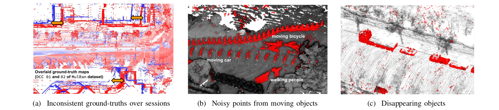
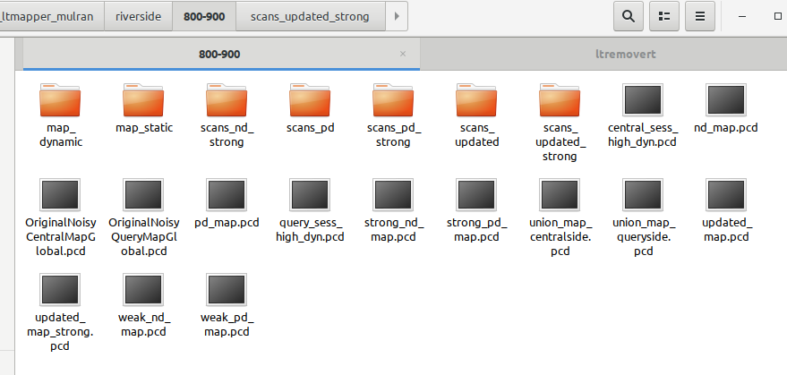

# LT-mapper: A Modular Framework for LiDAR-based Lifelong Mapping


<!-- ------------------------------------------ -->
<!-- ## Overview -->
**LT-mapper** is an open-source, modular framework designed for **LiDAR-based lifelong mapping** in dynamic environments. It enables robots to maintain accurate 3D maps over long time scales, addressing challenges such as:

- Multi-session trajectory alignment (LT-SLAM)
- High/low dynamic object filtering and change detection (LT-removert)
- Efficient map management and change composition (LT-map)
<p align="center"></p>
The framework supports real-world scenarios, handling ephemeral and persistent changes across multiple sessions without requiring perfect initial alignment.

For more deatils, please refer to our [paper](./doc/ltmapper.pdf) and [video](https://youtu.be/vlYKfp1p2j8).

<!-- ### Why LT-mapper? -->
<!-- - For LiDAR-based long-term mapping, three challenges exist.  -->
  <!-- <p align="center"></p> -->

## Features 
- **Multi-Session SLAM (LT-SLAM):** Align multiple sessions in a shared coordinate system using anchor-node-based pose graph optimization.
- **Dynamic Object Removal (LT-removert):** Efficiently filter high dynamic points and detect low-dynamic changes between sessions.
- **Map Management (LT-map):** Maintain live maps, generate meta-maps, and efficiently compose changes using delta maps.
- **Seamless Modular Integration:** Each module can run seperately via file-based in/out protocol.
<p align="center"></p>

<!-- ------------------------------------------ -->
## Getting Started
### Prerequisites 
- ROS (tested with Melodic and Noetic)
```shell
sudo apt install -y ros-distro-navigation
sudo apt install -y ros-distro-robot-localization
sudo apt install -y ros-distro-robot-state-publisher
```
- GTSAM
```shell
sudo add-apt-repository ppa:borglab/gtsam-release-4.0
sudo apt install -y libgtsam-dev libgtsam-unstable-dev
```

### Installation
#### Clone the repository
```shell
cd ~/catkin_ws/src
git clone https://github.com/gisbi-kim/lt-mapper
```

#### Build the package
```shell
cd ..
catkin build ltslam removert
```

#### Using Docker
```shell
cd ~/catkin_ws/src/lt-mapper/docker
bash build.sh
bash run.sh
```
or you can pull the pre-built image from Docker Hub.
```shell
docker pull dongjae0107/lt-mapper:latest
bash run.sh
```

<!-- ------------------------------------------ -->
## How to use it

### 0. Single-session Data Generation
To run the LT-mapper, you first need to generate a set of session data containing the following files:

- **Keyframe Point Clouds**  
- **Keyframe Scan Context Descriptors (SCDs)**  
- **Pose Graph File**

You can generate these session data files using the [saver tool](https://github.com/gisbi-kim/SC-LIO-SAM#applications) provided with [SC-LIO-SAM](https://github.com/gisbi-kim/SC-LIO-SAM). Alternatively, the saver is also available in [SC-A-LOAM](https://github.com/gisbi-kim/SC-A-LOAM) and [FAST_LIO_SLAM](https://github.com/gisbi-kim/FAST_LIO_SLAM).

### 1. LT-SLAM
**LT-SLAM** module aligns trajectories across multiple sessions. For a step-by-step guide, check out this [tutorial video](https://youtu.be/BXBTVurNToU).

```shell
# modify paths in ltslam/config/params.yaml before you run
roslaunch ltslam run.launch
```

### 2. LT-removert & LT-map
**LT-removert & LT-map** module utilize [Removert](https://github.com/gisbi-kim/removert) to clean single-session data and detect changes between two sessions. 

```shell
# modify paths in ltremovert/config/params_ltmapper.yaml before you run
roslaunch removert run_ltmapper.launch
```

**Outputs**

Once the process is complete, following outputs will be generated:
  <p align="center"></p>


<!-- ------------------------------------------ -->
## Example: LT-mapper on ParkingLot dataset

You can download the ParkingLot dataset from this [link](https://bit.ly/ltmapper_parkinglot_data). To replay the data, you may need a [file player](https://github.com/RPM-Robotics-Lab/file_player_mulran).

ParkingLot dataset includes 6 sequences captured over three days at the same spatial site but with varying initial poses.

#### Step 1: Run LT-SLAM
Update paths in ``ltslam/config/param.yaml`` and execute LT-SLAM.

LT-SLAM will automatically align multiple sessions within a shared coordinate system.

<p align="center"></p>

#### Step 2: Run LT-Removert & LT-Map
Update paths in ``ltremovert/config/param_ltmapper.yaml`` and execute LT-removert & LT-map.

After running LT-Removert & LT-Map, you will get cleaned session data and detected changes between sessions.


<!-- - For the details of use, see [this tutorial video (TBA)](TBA). -->

<!-- ------------------------------------------ -->
## Citation
```bibtex
@inproceedings{kim2022lt,
  title={Lt-mapper: A modular framework for lidar-based lifelong mapping},
  author={Kim, Giseop and Kim, Ayoung},
  booktitle={2022 International Conference on Robotics and Automation (ICRA)},
  pages={7995--8002},
  year={2022},
  organization={IEEE}
}
```

<!-- ------------------------------------------ -->
## Contact 
- Maintained by Giseop Kim and please contact the author via ``gsk@dgist.ac.kr``

### Acknowledgement 
- Big thanks to [Dongjae Lee](https://dongjae0107.github.io/) for contributions in refactoring, dockerization, documentation, and various verifications.

### Contributors 
<a href="https://github.com/gisbi-kim/lt-mapper/graphs/contributors">
  
</a>
