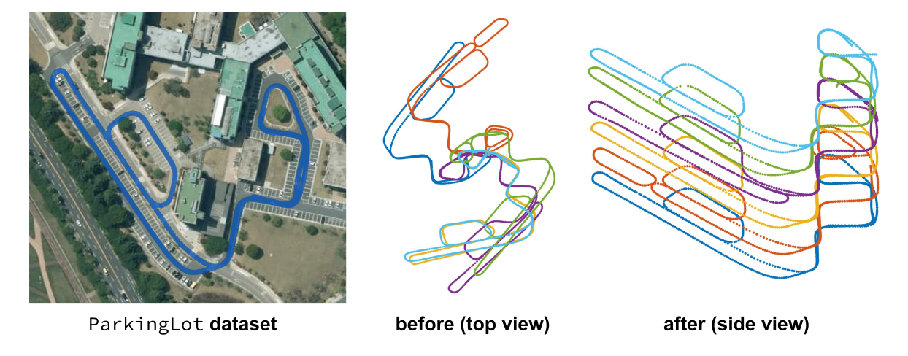

# LT-mapper (ICRA 22)

<!-- ------------------------------------------ -->
## What is LT-mapper?
- A Modular Framework for LiDAR-based Lifelong Mapping
  - [Paper](./doc/ltmapper-v1.pdf)
  - [Video](https://youtu.be/vlYKfp1p2j8)

### Why LT-mapper?
- For LiDAR-based long-term mapping, three challenges exist. 
  <p align="center"></p>

### Features 
- TBA


<!-- ------------------------------------------ -->
## How to use?

### Prerequisites 
- TBA

### build 
- TBA
 
<!-- ------------------------------------------ -->
## Tutorial and examples

### 0. Single-session Data Generation 
- Using [the saver](https://github.com/gisbi-kim/SC-LIO-SAM#applications) provided with [SC-LIO-SAM](https://github.com/gisbi-kim/SC-LIO-SAM) (also in [SC-A-LOAM](https://github.com/gisbi-kim/SC-A-LOAM)  or [FAST_LIO_SLAM](https://github.com/gisbi-kim/FAST_LIO_SLAM)), a user should generate the set of sesssion data (i.e., keyframe point cloud scans, keyframe scan context descriptors (SCDs), and an initial pose-graph text file) for each session. 

### 1. LT-SLAM 
- [Tutorial video](https://youtu.be/BXBTVurNToU)
 
- command
  ```
    # change the paths in ltslam/config/params.yaml
    roslaunch ltslam run.launch
  ```

### 2. LT-removert and LT-map
- `ltremovert` directory runs removert (for single-session cleaning) and change detection between two sessions. 
- command
  ```
    TBA
  ```
- Outputs
  <p align="center"></p>


<!-- ------------------------------------------ -->
## LT-mapper ParkingLot dataset 
- LT-mapper ParkingLot dataset contains six sequences during three days for the same spatial site, but different initial poses. 
- LT-SLAM automatically aligns them in a shared coordinate.
  <p align="center"></p>
- [Dataset Download Link](https://bit.ly/ltmapper_parkinglot_data). A sequence is replayable using [MulRan File Player](https://github.com/irapkaist/file_player_mulran). 
  - For the details of use, see [this tutorial video (TBA)](TBA). 

<!-- ------------------------------------------ -->
## Citation
```
@INPROCEEDINGS { kim2021ltmapper,
    AUTHOR = { Giseop Kim, Ayoung Kim },
    TITLE = { {LT-mapper: A Modular Framework for LiDAR-based Lifelong Mapping} },
    BOOKTITLE = { Proceedings of the IEEE International Conference on Robotics and Automation (ICRA) },
    YEAR = { 2022 },
}
```

<!-- ------------------------------------------ -->
## Contact 
- Maintained by Giseop Kim and please contact the author via ``giseop.kim@naverlabs.com``

